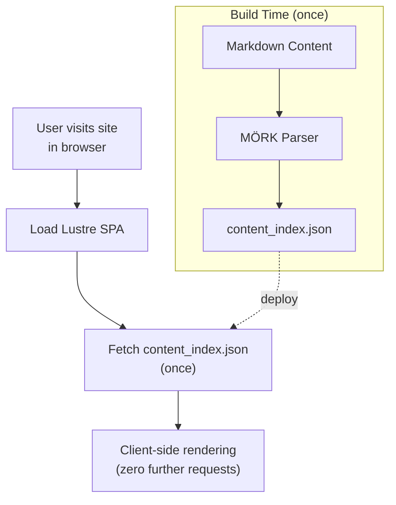

<div align="center">
<br />

# Arata

**A faithful reimplementation of the [apollo](https://github.com/not-matthias/apollo) blog theme, built with [Gleam](https://gleam.run) and the [Lustre](https://hexdocs.pm/lustre) framework.**

[](LICENSE)
[](https://github.com/yonzilch/arata/deployments)
[](https://github.com/yonzilch/arata/tags)
[](https://gleam.run)

</div>

Arata reproduces apollo's minimal, typography-driven aesthetic as a client-side single-page application.

Content is authored in Markdown, parsed at build time by [MÖRK](https://hex.pm/packages/mork) (a pure-Gleam CommonMark + GFM parser)

And served as a [Lustre](https://github.com/lustre-labs/lustre) SPA that fetches a single `content_index.json` at runtime.

> Load once, then everything done in client-side browser.
>
> The tech structure bring a remarkable performance experience.




## Stack

- **Language:** Gleam (compiles to JavaScript)
- **Framework:** Lustre (The Elm Architecture, client-side SPA)
- **Routing:** modem (History API)
- **Markdown:** mork with opt-in extensions enabled for GFM tables, task lists, emoji shortcodes, autolinks, and footnotes
- **HTTP:** rsvp (browser `fetch` for `content_index.json`)
- **Frontmatter / files:** tom (TOML parser), simplifile (build-time file I/O)
- **JSON:** gleam_json
- **Build/dev:** `bun run build` (no Erlang/OTP required); `bun run dev` (dev)

## Features

- **File-based content model** — posts, pages, links, and projects are `.md` files under `content/` with TOML frontmatter
- **Markdown rendering** — Markdown bodies are parsed at build time and stored as pre-rendered HTML in `content_index.json`
- **GFM Markdown extensions** — tables, task lists, emoji shortcodes, autolinks, and footnotes are enabled through mork options
- **9 routes**: `/`, `/posts`, `/posts/{slug}`, `/projects`, `/links`, `/tags`, `/tags/{name}`, `/{slug}` (standalone pages), and a 404 page
- **3-state theme toggle** (Light / Dark / Auto) with `localStorage` persistence and `prefers-color-scheme` reactivity
- **Cmd/Ctrl+K search** modal with keyboard navigation (toggle with `search_enabled`)
- **Table of contents** with scroll-driven `IntersectionObserver` highlighting
- **Floating ToC + Tags button** visible on **all screen sizes** — opens an overlay with the ToC tree and a Tags list for quick navigation
- **Fancy code blocks** with copy button + language label
- **3 shortcodes**: `note`, `character`, `image`
- **MathJax Rendering** toggle with `mathjax_enabled`
- **Mermaid diagrams** — use native Markdown fenced code blocks with `mermaid` language for client-side rendering
- **Post cards** — each post on `/posts` is wrapped in a bordered card with a hover effect, with clickable tag pills between the title and content
- **Page-jump input** — type a page number in the pagination bar and press Enter to jump straight to that page
- **CJK-aware** slugify (punctuation-denylist, sequential fallback IDs) and word count (multi-byte characters counted as individual words)
- **Weighted friend links** — `/links` supports Zola-style `weight`; lower values appear earlier, with deterministic lowercase-title fallback ordering
- **Zola-compatible friend link fields** — links can use `[extra].link_to` and `[extra].remote_image`
- **Multi-platform Git hosting** — the `Project` type has `github`, `gitlab`, `codeberg`, and `forgejo` fields so projects hosted on any of those platforms link correctly from the card footer
- **SEO** meta, OpenGraph, Atom/RSS feeds, sitemap, `robots.txt`, and `llms.txt`
- **Analytics**: GoatCounter, Umami, Liwan (Google Analytics intentionally not supported)
- **Comments**: Giscus, Utterances
- **Inline CSS shell** — CSS modules are inlined into `index.html` and `404.html` to remove render-blocking stylesheet requests; `dist/css/` is still emitted for inspection/debugging
- **Config toggles** — `sidebar_enabled`, `floating_buttons_enabled`, `search_enabled`, `rss_enabled`, `mathjax_enabled`, and `aratafetch_enabled` let you turn features on or off without touching view code
- **Configurable logo and favicon** — both are configured from `src/config.gleam`
- **Build pipeline**: `gleam run -m build/pipeline` → complete static site in `dist/` (no Erlang/OTP required)

- **aratafetch** — optional neofetch-style ASCII site summary showing site title, published post count, total word count, unique tag count, friend link count, project count, and optional maintenance string

- **Theme-Aware Accent Color** — switch by one botton between light  `#5f7eea` (Cornflower Blue) and dark  `#2f4fa3` (Royal Azure).

### Dependencies

- [Bun](https://bun.com/)
- [Gleam](https://gleam.run/)

| Package              | Version constraint            | Purpose |
|----------------------|-------------------------------|---------|
| `gleam_stdlib`       | `>= 0.44.0 and < 2.0.0`        | stdlib |
| `lustre`             | `>= 5.7.0 and < 6.0.0`         | UI framework (Elm Architecture) |
| `modem`              | `>= 2.1.3 and < 3.0.0`         | client-side routing |
| `gleam_json`         | `>= 3.1.0 and < 4.0.0`         | JSON encode/decode |
| `simplifile`         | `>= 2.4.0 and < 3.0.0`         | build-time file I/O |
| `mork`               | `>= 1.12.1 and < 2.0.0`        | CommonMark + GFM markdown parser |
| `mork_to_lustre`     | `>= 1.0.0 and < 2.0.0`         | mork → Lustre element bridge |
| `tom`                | `>= 2.1.0 and < 3.0.0`         | TOML frontmatter parser |
| `rsvp`               | `>= 2.0.0 and < 3.0.0`         | HTTP (content index fetch) |
| `gleeunit` *(dev)*   | `>= 1.0.0 and < 2.0.0`         | unit tests |

## Quick start

```sh
# Type-check and compile the project
gleam build

# Run the test suite
gleam test

# Build a complete static site into dist/
gleam run -m build/pipeline

# Serve dist/ directory locally
bun run dev

# open in browser

http://localhost:3333/

````

The build pipeline is self-contained: it reads the `.md` files under `content/`, parses the TOML frontmatter with `tom`, renders the Markdown bodies with `mork`, serializes everything to `dist/content_index.json` and `dist/search_index.json`, emits feeds, sitemap, `robots.txt`, and `llms.txt`, writes `index.html` and `404.html` with inline CSS, copies `static/` to `dist/`, and bundles the SPA into `dist/app.mjs` via `bun run build`.

At runtime, the SPA fetches `/content_index.json` once on boot (`rsvp`), decodes it with `gleam/dynamic/decode`, and hands the typed content tree to the Lustre view layer. The browser never touches the file system.

## Project layout

```txt
arata/
├── content/                   # file-based content (authored Markdown)
│   ├── posts/*.md             # blog posts
│   │   ├── CHANGEGLOG.md      # CHANGELOG of Arata project (Only in demo site)
│   │   ├── ROADMAP.md         # v1.0.0 ROADMAP of Arata project (Future plans not included)
│   │   └── ...                # Other demo site content (markdown-test.md, deployment.md etc.)
│   ├── pages/*.md             # standalone pages (incl. home.md, about.md)
│   ├── links/*.md             # friend-link cards
│   └── projects/*.md          # project showcase cards
├── src/
│   ├── arata.gleam            # entry point (boots Lustre)
│   ├── route.gleam            # URL <-> Route mapping (modem)
│   ├── config.gleam           # Config defaults + SiteMeta defaults
│   ├── build/                 # content -> dist/ pipeline + feeds + crawler files
│   │   ├── pipeline.gleam     # orchestrator
│   │   ├── feeds.gleam        # atom.xml, rss.xml, sitemap.xml
│   │   ├── robots.gleam       # robots.txt
│   │   └── llms.gleam         # llms.txt
│   ├── content/
│   │   ├── loader.gleam       # build-time .md reader (simplifile + tom + mork)
│   │   └── runtime.gleam      # browser-side content_index.json fetch (rsvp)
│   │── css/                   # 13 CSS modules (inlined into HTML shell at build time)
│   │   ├── base.css           # theme vars, html/body, headings, links
│   │   ├── layout.css         # .arata-shell, .content, nav, .logo
│   │   ├── components.css     # .page-header, .post-list, tags, icon buttons, sidebar post tags
│   │   ├── pagination.css     # pagination links and page-jump input
│   │   ├── post.css           # blockquote, .tldr, img/figure, table, code, labels
│   │   ├── cards.css          # .cards, .card-*, project cards
│   │   ├── links.css          # friend-link avatars
│   │   ├── search.css         # search button/modal/results
│   │   ├── toc.css            # table of contents
│   │   ├── syntax.css         # giallo light/dark syntax highlighting
│   │   ├── lightbox.css       # Markdown image lightbox overlay
│   │   ├── aratafetch.css     # homepage neofetch-style summary
│   │   └── accessibility.css  # :focus-visible outlines + .skip-link
│   ├── data/                  # content models + shared metadata types
│   │   ├── site.gleam         # SiteMeta, Analytics, CommentsConfig types
│   │   ├── post.gleam         # Post type
│   │   ├── project.gleam      # Project type
│   │   ├── link.gleam         # Link type
│   │   ├── page.gleam         # Page type
│   │   └── markdown.gleam     # mork -> HTML wrapper with extension options
│   ├── effect/                # managed side effects (FFI)
│   ├── ffi/                   # JavaScript FFI
│   │── shortcodes/            # note, character, image
│   ├── view/                  # page + component views
│   │   ├── aratafetch.gleam   # homepage ASCII summary component
│   └── └── ...                # remaining view components
├── static/                    # fonts, icons, images, vendored CSS
├── test/                      # unit tests
├── flake.nix                  # provide reproduceable development environment
├── gleam.toml                 # declare dependencies and metadata of project
└── package.json               # declare commands using in development

```

## Content authoring

All content lives under `content/` in four subdirectories. Each Markdown file uses **TOML frontmatter** delimited by `+++ ... +++`.

Only the required fields need to be present. Fields such as `description`, `tags`, `draft`, and `tldr` are optional and may be omitted when they are not needed.

```toml
+++
title = "Hello, Arata"
date = "2026-06-21"
description = "Introducing Arata"
tags = ["gleam", "lustre"]
draft = false
tldr = "Arata rebuilds the apollo blog theme as a Gleam/Lustre single-page app with client-side routing and a hand-ported CSS design system."
+++

Body in Markdown — parsed by mork at build time.
```

| Directory               | Type    | Frontmatter                                                                                                 |
| ----------------------- | ------- | ----------------------------------------------------------------------------------------------------------- |
| `content/posts/*.md`    | Post    | `title`, `date`, `updated`, `description`, `tags`, `draft`, `tldr`                                          |
| `content/pages/*.md`    | Page    | `title`, `subtitle`                                                                                         |
| `content/links/*.md`    | Link    | `title`, `url` or `[extra].link_to`, `description`, `image` or `[extra].remote_image`, `weight`             |
| `content/projects/*.md` | Project | `title`, `description`, `link_to`, `image`, `github`, `gitlab`, `codeberg`, `forgejo`, `demo`, `tags`       |

The Markdown body is rendered to HTML by mork at build time and stored in `content_index.json`. The SPA fetches this JSON once at boot — there is no Markdown parsing in the browser.

See [content-authoring.md](content/posts/content-authoring.md) for the full content authoring guide.

### Markdown support

Arata enables mork's extended options for:

* GFM tables
* task list items
* emoji shortcodes
* autolinks
* footnotes

Heading IDs are handled by arata's own content loader instead of mork's built-in heading ID option, so CJK headings can fall back to stable ASCII IDs such as `heading-1`, `heading-2`, and so on.

### Friend link ordering

Friend links support Zola-style `weight`:

```toml
+++
title = "Friend Blog"
url = "https://friend.example.com"
description = "A short description."
image = "https://friend.example.com/avatar.png"
weight = 10
+++
```

Lower weights appear earlier on `/links`. When two links have the same weight, arata falls back to lowercase title ordering for deterministic output. Links without `weight` default to `999`.

Arata also supports Zola-style fields:

```toml
+++
title = "A Friend's Blog"
description = "A short description."
weight = 6

[extra]
link_to = "https://friend.example.com"
remote_image = "https://friend.example.com/avatar.avif"
+++
```

### Homepage and aratafetch

The homepage is the special page at:

```txt
content/pages/home.md
```

It renders at `/`.

When `aratafetch_enabled` is `True`, arata renders a neofetch-style ASCII summary block below the homepage Markdown body.
The summary is computed from the loaded runtime content model and includes published post count, total word count, unique tag count, friend link count, project count, and an optional maintenance string.

## Configuration

Arata is configured through two Gleam modules:

* **`src/config.gleam`** — the user-facing configuration source: `Config`, `config.default()`, and `config.site_meta()`.
* **`src/data/site.gleam`** — shared metadata types: `SiteMeta`, `Analytics`, and `CommentsConfig`.

`config.gleam` is the single source for default site values. Both the SPA runtime and build pipeline read from it so title, description, RSS settings, analytics, comments, and favicon configuration do not drift.

Highlights:

* **`logo`** (`Option(String)`) — optional header logo path. Prefer absolute paths like `Some("/images/avatar.avif")`.
* **`favicon`** (`Option(String)`) — optional favicon path used when generating `index.html` and `404.html`.
* **`rss_enabled`** (`Bool`) — when `False`, no `atom.xml` / `rss.xml` are written, no feed `<link>` tags are emitted, and the RSS social is dropped from the header.
* **`search_enabled`** (`Bool`) — when `False`, the search button, modal, and `Cmd/Ctrl+K` shortcut are all omitted.
* **`mathjax_enabled`** (`Bool`) — when `True`, MathJax is loaded on post pages and `$…$` / `$$…$$` LaTeX is typeset.
* **Built-in image lightbox gallery** — Markdown body images open in a Lustre-managed fullscreen gallery overlay with captions, keyboard navigation, touch-friendly controls, and page scroll locking.
* **`sidebar_enabled`** (`Bool`, default `True`) — when `False`, the right sidebar (ToC + Tags) is omitted on post pages so the body takes the full content width.
* **`floating_buttons_enabled`** (`Bool`, default `True`) — when `False`, the floating ToC/tags FAB and the overlay's scroll-to-top button are not rendered.
* **`aratafetch_enabled`** (`Bool`) — when `True`, the homepage renders the optional aratafetch ASCII summary block below the Markdown body.
* **`aratafetch_maintained_for`** (`Option(String)`) — optional display string for aratafetch's `maintained` row, for example `Some("since 2024-06-23")`.
* **`fonts`** — a `Fonts(text, header, code)` record of CSS `font-family` declarations. Defaults to system font stacks.
* **`analytics`** — `AnalyticsDisabled`, `GoatCounter(data_goatcounter, src)`, `Umami(website_id, src)` or `Liwan(data_entity, src)`. Google Analytics is intentionally not supported.
* **Accent/Primary color** — edit `--primary-color` in `src/css/theme.css` to recolor accent surfaces. Arata defines separate light and dark accent values in `:root` and `:root.dark` for better contrast across themes.

See [configuration.md](content/posts/configuration.md) for the full configuration guide.

## CSS

Arata keeps its source CSS split into 17 modules under `src/css/`:

```txt
fonts.css
theme.css
globals.css
typography.css
home.css
layout.css
components.css
pagination.css
post.css
cards.css
links.css
search.css
toc.css
syntax.css
lightbox.css
aratafetch.css
accessibility.css
````

During the build, these modules are copied to `dist/css/` for inspection and debugging.

For runtime performance, however, the SPA shell no longer references them through render-blocking `<link rel="stylesheet">` tags.

Instead, the build pipeline inlines the CSS modules into `index.html` and `404.html` inside a `<style>` block.

The CSS order is fixed and important:

```txt
fonts
theme
globals
typography
home
layout
components
pagination
post
cards
links
search
toc
syntax
lightbox
aratafetch
accessibility
```

`fonts.css` must come first because it declares bundled font faces.

`theme.css` must come before all other modules that use CSS variables.

`globals.css` sets document-level defaults and responsive root scaling.

`typography.css` defines global heading, link, selection, separator, time, deletion, and MathJax overflow behavior.

`home.css` comes after typography so homepage latest-post styles can override global link hover behavior.

`accessibility.css` should remain last because it contains focus-visible and accessibility overrides.

## Build output

`gleam run -m build/pipeline` produces a complete static site in `dist/`:

```txt
dist/
├── index.html              # SPA shell with inline CSS and feed <link> tags
├── 404.html                # identical SPA shell — served on deep links
├── app.mjs                 # bundled Lustre SPA
├── content_index.json      # content manifest fetched by the SPA
├── search_index.json       # search corpus
├── atom.xml                # Atom feed (when rss_enabled)
├── rss.xml                 # RSS 2.0 feed (when rss_enabled)
├── sitemap.xml             # sitemap
├── robots.txt              # crawler policy with Sitemap directive
├── llms.txt                # Markdown site map for LLM/agent consumers
├── css/                    # copied CSS modules for inspection/debugging
├── fonts/
├── icons/
└── images/
```

`atom.xml` and `rss.xml` are only emitted when RSS is enabled.

`sitemap.xml`, `robots.txt`, and `llms.txt` are emitted independently of RSS.

## Local development

Hot reload is supported:

```sh
bun run dev
```

Then open:

```txt
http://localhost:3333/
```

Write or update some content, the dev site of arata would automatically send refresh signal to browser.

## Deployment

Serve `dist/` with any static file host (Cloudflare Pages, Deno Deploy, Netlify, Vercel etc.)

See [deployment.md](content/posts/deployment.md) for the full deployment guide.

## Testing

Run:

```sh
gleam test
```

The test suite covers routing, card behavior, feeds, data helpers, link weight ordering, aratafetch statistics, and other build/runtime invariants.

## Origin

Arata reproduces the design and feature set of the [apollo](https://github.com/not-matthias/apollo) Zola theme as a Gleam/Lustre SPA.

See [ROADMAP.md](content/posts/ROADMAP.md) for the full mapping from apollo's templates and SCSS to Lustre views and plain CSS.

BTW, you could trace latest version changes from [CHANGELOG.md](content/posts/CHANGELOG.md)

## License

This project is licensed under the **MIT license**. See [LICENSE](LICENSE) for more information.

## Acknowledgments

Thanks to original upstream [apollo](https://github.com/not-matthias/apollo) and its initial fork [archie-zola](https://github.com/XXXMrG/archie-zola/)

Thanks to [archie-zola](https://github.com/XXXMrG/archie-zola/) and its initial fork [archie](https://github.com/athul/archie)

Thanks to [archie](https://github.com/athul/archie) and its initial fork [ezhil](https://github.com/vividvilla/ezhil)

Thanks to [Gleam Lang](https://github.com/gleam-lang/) and shine ✨ community!

Arata can not born without these fantastic repositories and projects!

---

<div align="center">
  Developing with ♥️ and your support 🌟
</div>
