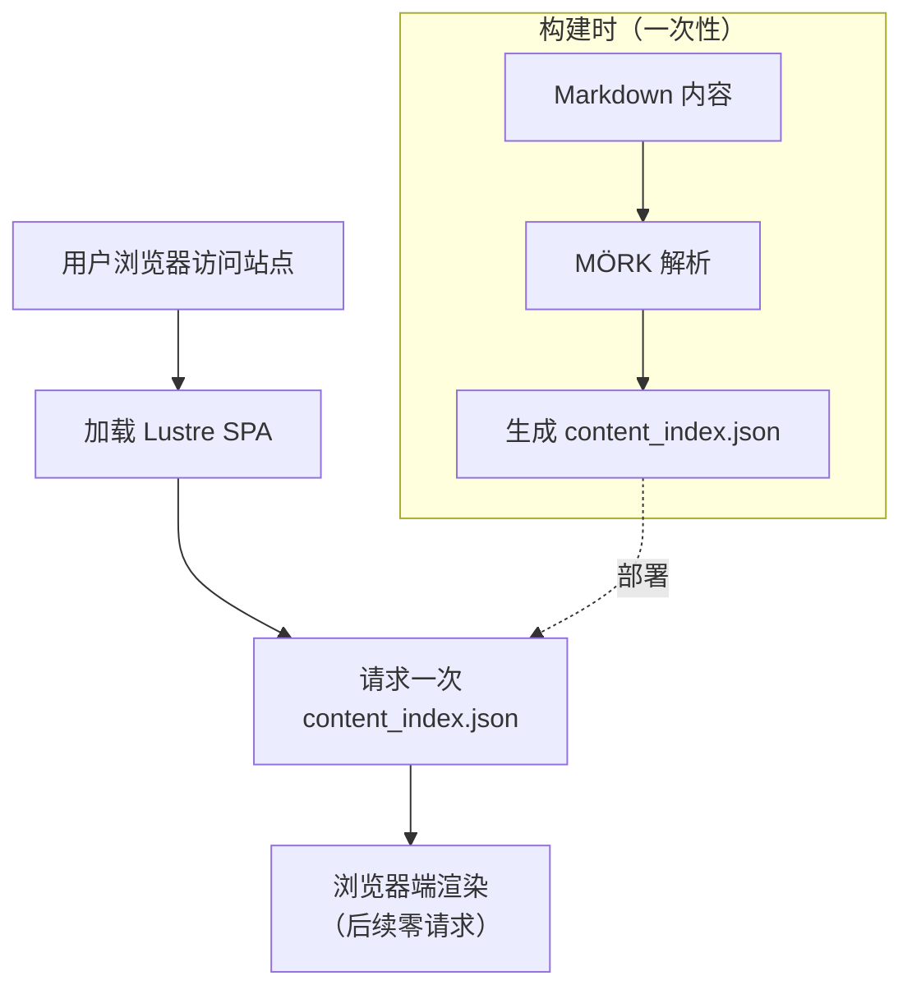

+++
title = "README_zh-CN"
description = "Arata 中文版本 README（同时用于测试 HTML 与 CJK 渲染）； 此 README 可能无法反映项目最新变动情况"
date = "2026-07-05"
updated = "2026-07-05"
+++

<div align="center">
<br />

# Arata

**对 [apollo](https://github.com/not-matthias/apollo) 博客主题的忠实复刻，使用 [Gleam](https://gleam.run) 语言与 [Lustre](https://hexdocs.pm/lustre) 框架构建。**

[](LICENSE)
[]()
[]()
[](https://gleam.run)

</div>

Arata 以客户端单页应用（SPA）的形式，还原了 apollo 极简、以排版为核心的美学风格。

内容以 Markdown 编写，在构建时由 [MÖRK](https://hex.pm/packages/mork)（一个纯 Gleam 实现的 CommonMark + GFM 解析器）解析。

并以 [Lustre](https://github.com/lustre-labs/lustre) SPA 的形式提供服务，运行时只需拉取一次 `content_index.json` 文件。

> 只需加载一次，之后所有操作都在客户端浏览器中完成。
>
> 这样的技术架构带来了出色的性能体验。



## 技术栈

- **语言：** Gleam（编译为 JavaScript）
- **框架：** Lustre（Elm 架构，客户端 SPA）
- **路由：** modem（History API）
- **Markdown：** mork，并启用了 GFM 表格、任务列表、emoji 短代码、自动链接和脚注等可选扩展
- **HTTP：** rsvp（浏览器 `fetch`，用于获取 `content_index.json`）
- **Frontmatter / 文件：** tom（TOML 解析器）、simplifile（构建时文件 I/O）
- **JSON：** gleam_json
- **构建 / 开发：** `bun run build`（无需 Erlang/OTP）；`bun run dev`（开发模式）

## 功能特性

- **基于文件的内容模型** —— 文章、页面、友链和项目均为 `content/` 目录下带有 TOML frontmatter 的 `.md` 文件
- **Markdown 渲染** —— Markdown 正文在构建时解析，并以预渲染的 HTML 形式存储在 `content_index.json` 中
- **GFM Markdown 扩展** —— 通过 mork 的选项启用了表格、任务列表、emoji 短代码、自动链接和脚注
- **9 条路由**：`/`、`/posts`、`/posts/{slug}`、`/projects`、`/links`、`/tags`、`/tags/{name}`、`/{slug}`（独立页面）以及 404 页面
- **三态主题切换**（浅色 / 深色 / 自动），通过 `localStorage` 持久化，并响应 `prefers-color-scheme`
- **Cmd/Ctrl+K 搜索**弹窗，支持键盘导航（可通过 `search_enabled` 开关控制）
- **目录（ToC）** —— 基于滚动位置的 `IntersectionObserver` 高亮
- **悬浮式目录 + 标签按钮**，在**所有屏幕尺寸**下均可见 —— 打开一个包含目录树和标签列表的浮层，方便快速导航
- **精美代码块**，带有复制按钮和语言标签
- **4 种短代码**：`note`、`character`、`image`、`mermaid`
- **MathJax 渲染**开关，通过 `mathjax_enabled` 控制
- **文章卡片** —— `/posts` 页面上每篇文章都包裹在带悬浮效果的边框卡片中，标题与正文之间是可点击的标签胶囊
- **页码跳转输入框** —— 在分页栏中输入页码并按下回车即可直接跳转到该页
- **CJK 友好**的 slugify（标点符号黑名单、连续编号的 ID 兜底方案）以及字数统计（多字节字符按单个词计算）
- **带权重的友链** —— `/links` 支持 Zola 风格的 `weight` 字段；数值越小越靠前显示，相同权重时按标题小写字母顺序作为确定性兜底排序
- **兼容 Zola 的友链字段** —— 友链支持使用 `[extra].link_to` 和 `[extra].remote_image`
- **多平台 Git 托管支持** —— `Project` 类型包含 `github`、`gitlab`、`codeberg` 和 `forgejo` 字段，因此托管在这些平台上的项目都能在卡片底部正确显示链接
- **SEO** 元数据、OpenGraph、Atom/RSS 订阅、站点地图、`robots.txt` 以及 `llms.txt`
- **统计分析**：GoatCounter、Umami（有意不支持 Google Analytics）
- **评论系统**：Giscus、Utterances
- **内联 CSS 外壳** —— CSS 模块被内联进 `index.html` 和 `404.html`，以消除阻塞渲染的样式表请求；`dist/css/` 仍会生成，方便检查和调试
- **配置开关** —— `sidebar_enabled`、`floating_buttons_enabled`、`search_enabled`、`rss_enabled`、`mathjax_enabled` 以及 `aratafetch_enabled`，无需修改视图代码即可开启或关闭相应功能
- **可配置的 Logo 与 Favicon** —— 二者均在 `src/config.gleam` 中配置
- **构建流水线**：`gleam run -m build/pipeline` → 在 `dist/` 中生成完整的静态站点（无需 Erlang/OTP）

- **aratafetch** —— 可选的 neofetch 风格 ASCII 站点摘要，展示站点标题、已发布文章数、总字数、唯一标签数、友链数、项目数，以及可选的维护状态说明文字

- **主题感知的强调色** —— 一键切换浅色  `#5f7eea`（矢车菊蓝）与深色  `#2f4fa3`（皇家蔚蓝）

### 依赖项

- [Bun](https://bun.com/)
- [Gleam](https://gleam.run/)

| 包名                  | 版本约束                       | 用途 |
|----------------------|-------------------------------|---------|
| `gleam_stdlib`       | `>= 0.44.0 and < 2.0.0`        | 标准库 |
| `lustre`             | `>= 5.7.0 and < 6.0.0`         | UI 框架（Elm 架构） |
| `modem`              | `>= 2.1.3 and < 3.0.0`         | 客户端路由 |
| `gleam_json`         | `>= 3.1.0 and < 4.0.0`         | JSON 编解码 |
| `simplifile`         | `>= 2.4.0 and < 3.0.0`         | 构建时文件 I/O |
| `mork`               | `>= 1.12.1 and < 2.0.0`        | CommonMark + GFM Markdown 解析器 |
| `mork_to_lustre`     | `>= 1.0.0 and < 2.0.0`         | mork → Lustre 元素桥接 |
| `tom`                | `>= 2.1.0 and < 3.0.0`         | TOML frontmatter 解析器 |
| `rsvp`               | `>= 2.0.0 and < 3.0.0`         | HTTP（内容索引获取） |
| `gleeunit` *（开发依赖）*   | `>= 1.0.0 and < 2.0.0`         | 单元测试 |

## 快速开始

```sh
# 类型检查并编译项目
gleam build

# 运行测试套件
gleam test

# 构建完整静态站点到 dist/
gleam run -m build/pipeline

# 在本地提供 dist/ 目录服务
bun run dev

# 在浏览器中打开

http://localhost:3333/

````

构建流水线是自包含的：它读取 `content/` 目录下的 `.md` 文件，使用 `tom` 解析 TOML frontmatter，使用 `mork` 渲染 Markdown 正文，将所有内容序列化为 `dist/content_index.json` 和 `dist/search_index.json`，生成订阅源、站点地图、`robots.txt` 以及 `llms.txt`，写入带有内联 CSS 的 `index.html` 和 `404.html`，将 `static/` 复制到 `dist/`，并通过 `bun run build` 将 SPA 打包为 `dist/app.mjs`。

在运行时，SPA 在启动时（通过 `rsvp`）一次性获取 `/content_index.json`，使用 `gleam/dynamic/decode` 解码，并将类型化的内容树交给 Lustre 视图层。浏览器完全不需要接触文件系统。

## 项目结构

```txt
arata/
├── content/                   # 基于文件的内容（作者编写的 Markdown）
│   ├── posts/*.md             # 博客文章
│   │   ├── CHANGEGLOG.md      # Arata 项目的 CHANGELOG（仅出现在演示站点中）
│   │   ├── ROADMAP.md         # Arata 项目 v1.0.0 的 ROADMAP（不包含未来计划）
│   │   └── ...                # 其他演示站点内容（markdown-test.md、deployment.md 等）
│   ├── pages/*.md             # 独立页面（包括 home.md、about.md）
│   ├── links/*.md             # 友情链接卡片
│   └── projects/*.md          # 项目展示卡片
├── src/
│   ├── arata.gleam            # 入口文件（启动 Lustre）
│   ├── route.gleam            # URL <-> Route 映射（modem）
│   ├── config.gleam           # Config 与 SiteMeta 的默认值
│   ├── build/                 # content -> dist/ 流水线 + 订阅源 + 爬虫文件
│   │   ├── pipeline.gleam     # 编排器
│   │   ├── feeds.gleam        # atom.xml、rss.xml、sitemap.xml
│   │   ├── robots.gleam       # robots.txt
│   │   └── llms.gleam         # llms.txt
│   ├── content/
│   │   ├── loader.gleam       # 构建时的 .md 文件读取器（simplifile + tom + mork）
│   │   └── runtime.gleam      # 浏览器端 content_index.json 获取逻辑（rsvp）
│   │── css/                   # 13 个 CSS 模块（构建时内联到 HTML 外壳中）
│   │   ├── base.css           # 主题变量、html/body、标题、链接
│   │   ├── layout.css         # .arata-shell、.content、导航、.logo
│   │   ├── components.css     # .page-header、.post-list、标签、图标按钮、侧边栏文章标签
│   │   ├── pagination.css     # 分页链接与页码跳转输入框
│   │   ├── post.css           # 引用块、.tldr、图片/图注、表格、代码、标签
│   │   ├── cards.css          # .cards、.card-*、项目卡片
│   │   ├── links.css          # 友情链接头像
│   │   ├── search.css         # 搜索按钮/弹窗/结果
│   │   ├── toc.css            # 目录
│   │   ├── syntax.css         # giallo 浅色/深色语法高亮
│   │   ├── lightbox.css       # Markdown 图片灯箱浮层
│   │   ├── aratafetch.css     # 首页 neofetch 风格摘要
│   │   └── accessibility.css  # :focus-visible 轮廓样式 + .skip-link
│   ├── data/                  # 内容模型 + 共享元数据类型
│   │   ├── site.gleam         # SiteMeta、Analytics、CommentsConfig 类型
│   │   ├── post.gleam         # Post 类型
│   │   ├── project.gleam      # Project 类型
│   │   ├── link.gleam         # Link 类型
│   │   ├── page.gleam         # Page 类型
│   │   └── markdown.gleam     # mork -> HTML 包装器，附带扩展选项
│   ├── effect/                # 受控的副作用（FFI）
│   ├── ffi/                   # JavaScript FFI
│   │── shortcodes/            # note、character、image、mermaid
│   ├── view/                  # 页面与组件视图
│   │   ├── aratafetch.gleam   # 首页 ASCII 摘要组件
│   └── └── ...                # 其余视图组件
├── static/                    # 字体、图标、图片、第三方 CSS
├── test/                      # 单元测试
├── gleam.toml
├── manifest.toml
├── ROADMAP.md
└── CHANGELOG.md
```

## 内容编写

所有内容都存放在 `content/` 目录下的四个子目录中。每个 Markdown 文件使用由 `+++ ... +++` 分隔的 **TOML frontmatter**。

只有必填字段才需要出现。像 `description`、`tags`、`draft` 和 `tldr` 这样的可选字段，在不需要时可以省略。

```toml
+++
title = "Hello, Arata"
date = "2026-06-21"
description = "Introducing Arata"
tags = ["gleam", "lustre"]
draft = false
tldr = "Arata rebuilds the apollo blog theme as a Gleam/Lustre single-page app with client-side routing and a hand-ported CSS design system."
+++

正文使用 Markdown 编写 —— 在构建时由 mork 解析。
```

| 目录                    | 类型    | Frontmatter 字段                                                                                            |
| ----------------------- | ------- | ----------------------------------------------------------------------------------------------------------- |
| `content/posts/*.md`    | Post    | `title`、`date`、`updated`、`description`、`tags`、`draft`、`tldr`                                          |
| `content/pages/*.md`    | Page    | `title`、`subtitle`                                                                                         |
| `content/links/*.md`    | Link    | `title`、`url` 或 `[extra].link_to`、`description`、`image` 或 `[extra].remote_image`、`weight`             |
| `content/projects/*.md` | Project | `title`、`description`、`link_to`、`image`、`github`、`gitlab`、`codeberg`、`forgejo`、`demo`、`tags`       |

Markdown 正文在构建时由 mork 渲染为 HTML，并存储在 `content_index.json` 中。SPA 在启动时只获取一次此 JSON —— 浏览器中不会进行任何 Markdown 解析。

完整的内容编写指南请参见 [content-authoring.md](content-authoring.md)。

### Markdown 支持

Arata 启用了 mork 的以下扩展选项：

* GFM 表格
* 任务列表项
* emoji 短代码
* 自动链接
* 脚注

标题 ID 由 arata 自身的内容加载器处理，而非 mork 内置的标题 ID 选项，因此 CJK 标题可以回退到稳定的 ASCII ID，例如 `heading-1`、`heading-2` 等。

### 友链排序

友情链接支持 Zola 风格的 `weight` 字段：

```toml
+++
title = "Friend Blog"
url = "https://friend.example.com"
description = "A short description."
image = "https://friend.example.com/avatar.png"
weight = 10
+++
```

权重值越小，在 `/links` 页面上显示越靠前。当两个链接权重相同时，arata 会回退到标题小写字母顺序作为确定性排序方式。没有设置 `weight` 的链接默认值为 `999`。

Arata 同样支持 Zola 风格的字段：

```toml
+++
title = "A Friend's Blog"
description = "A short description."
weight = 6

[extra]
link_to = "https://friend.example.com"
remote_image = "https://friend.example.com/avatar.avif"
+++
```

### 首页与 aratafetch

首页是一个特殊页面，位于：

```txt
content/pages/home.md
```

它渲染在 `/` 路由上。

当 `aratafetch_enabled` 为 `True` 时，arata 会在首页 Markdown 正文下方渲染一个 neofetch 风格的 ASCII 摘要区块。
该摘要由已加载的运行时内容模型计算得出，包含已发布文章数、总字数、唯一标签数、友链数、项目数，以及可选的维护状态说明文字。

## 配置

Arata 通过两个 Gleam 模块进行配置：

* **`src/config.gleam`** —— 面向用户的配置源：`Config`、`config.default()` 以及 `config.site_meta()`。
* **`src/data/site.gleam`** —— 共享元数据类型：`SiteMeta`、`Analytics` 以及 `CommentsConfig`。

`config.gleam` 是站点默认值的唯一数据源。SPA 运行时和构建流水线都从这里读取数据，因此标题、描述、RSS 设置、统计分析、评论以及 favicon 配置不会出现不一致。

要点说明：

* **`logo`**（`Option(String)`）—— 可选的页头 Logo 路径。建议使用绝对路径，例如 `Some("/images/avatar.avif")`。
* **`favicon`**（`Option(String)`）—— 可选的 favicon 路径，用于生成 `index.html` 和 `404.html`。
* **`rss_enabled`**（`Bool`）—— 为 `False` 时，不会生成 `atom.xml` / `rss.xml`，不会输出订阅源 `<link>` 标签，页头也不会显示 RSS 社交图标。
* **`search_enabled`**（`Bool`）—— 为 `False` 时，搜索按钮、弹窗以及 `Cmd/Ctrl+K` 快捷键都会被省略。
* **`mathjax_enabled`**（`Bool`）—— 为 `True` 时，文章页面会加载 MathJax，并对 `$…$` / `$$…$$` LaTeX 语法进行排版。
* **内置图片灯箱画廊** —— Markdown 正文中的图片会在一个由 Lustre 管理的全屏画廊浮层中打开，支持图注、键盘导航、触屏友好的控件以及页面滚动锁定。
* **`sidebar_enabled`**（`Bool`，默认 `True`）—— 为 `False` 时，文章页面右侧的边栏（目录 + 标签）将被省略，正文将占据完整内容宽度。
* **`floating_buttons_enabled`**（`Bool`，默认 `True`）—— 为 `False` 时，悬浮的目录/标签按钮以及浮层中的回到顶部按钮都不会渲染。
* **`aratafetch_enabled`**（`Bool`）—— 为 `True` 时，首页会在 Markdown 正文下方渲染可选的 aratafetch ASCII 摘要区块。
* **`aratafetch_maintained_for`**（`Option(String)`）—— aratafetch `maintained` 行的可选显示文字，例如 `Some("since 2024-06-23")`。
* **`fonts`** —— 一个 `Fonts(text, header, code)` 记录，包含 CSS `font-family` 声明。默认使用系统字体族。
* **`analytics`** —— `AnalyticsDisabled`、`GoatCounter(user, host)` 或 `Umami(website_id, host_url)`。有意不支持 Google Analytics。
* **强调色/主色** —— 编辑 `src/css/theme.css` 中的 `--primary-color` 即可修改强调色表面。Arata 在 `:root` 与 `:root.dark` 中分别定义了浅色与深色的强调色值，以获得更好的主题对比度。

完整的配置指南请参见 [configuration.md](configuration)。

## CSS

Arata 将源 CSS 拆分为 `src/css/` 目录下的 17 个模块：

```txt
fonts.css
theme.css
globals.css
typography.css
home.css
layout.css
components.css
pagination.css
post.css
cards.css
links.css
search.css
toc.css
syntax.css
lightbox.css
aratafetch.css
accessibility.css
````

在构建过程中，这些模块会被复制到 `dist/css/`，以便检查和调试。

不过，为了提升运行时性能，SPA 外壳不再通过阻塞渲染的 `<link rel="stylesheet">` 标签引用它们。

取而代之的是，构建流水线会将 CSS 模块内联到 `index.html` 和 `404.html` 的 `<style>` 块中。

CSS 顺序是固定且重要的：

```txt
fonts
theme
globals
typography
home
layout
components
pagination
post
cards
links
search
toc
syntax
lightbox
aratafetch
accessibility
```

`fonts.css` 必须排在最前面，因为它声明了内嵌字体。

`theme.css` 必须排在所有使用 CSS 变量的其他模块之前。

`globals.css` 设置文档级别的默认值以及响应式的根缩放。

`typography.css` 定义全局标题、链接、选中态、分隔符、时间、删除线以及 MathJax 溢出行为。

`home.css` 排在 typography 之后，以便首页最新文章样式可以覆盖全局链接悬浮行为。

`accessibility.css` 应保持在最后，因为它包含 focus-visible 与无障碍相关的覆盖样式。

## 构建产物

`gleam run -m build/pipeline` 会在 `dist/` 中生成一个完整的静态站点：

```txt
dist/
├── index.html              # 带有内联 CSS 与订阅源 <link> 标签的 SPA 外壳
├── 404.html                # 相同的 SPA 外壳 —— 用于处理深层链接
├── app.mjs                 # 打包后的 Lustre SPA
├── content_index.json      # SPA 获取的内容清单
├── search_index.json       # 搜索语料库
├── atom.xml                # Atom 订阅源（当 rss_enabled 时）
├── rss.xml                 # RSS 2.0 订阅源（当 rss_enabled 时）
├── sitemap.xml             # 站点地图
├── robots.txt              # 带有 Sitemap 指令的爬虫策略
├── llms.txt                # 供 LLM/智能体使用的 Markdown 站点地图
├── css/                    # 用于检查/调试的已复制 CSS 模块
├── fonts/
├── icons/
└── images/
```

`atom.xml` 与 `rss.xml` 仅在启用 RSS 时才会生成。

`sitemap.xml`、`robots.txt` 以及 `llms.txt` 的生成与 RSS 是否启用无关。

## 本地开发

支持热重载：

```sh
bun run dev
```

然后打开：

```txt
http://localhost:3333/
```

编写或更新内容后，arata 的开发站点会自动向浏览器发送刷新信号。

## 部署

使用任意静态文件托管服务提供 `dist/` 目录（Cloudflare Pages、Deno Deploy、Netlify、Vercel 等均可）

完整的部署指南请参见 [deployment.md](deployment)。

## 测试

运行：

```sh
gleam test
```

测试套件覆盖了路由、卡片行为、订阅源、数据辅助函数、友链权重排序、aratafetch 统计信息以及其他构建/运行时的不变量。

## 项目起源

Arata 以 Gleam/Lustre SPA 的形式，复刻了 [apollo](https://github.com/not-matthias/apollo) 这个 Zola 主题的设计与功能集。

从 apollo 的模板与 SCSS 到 Lustre 视图与纯 CSS 的完整映射关系，请参见 [ROADMAP.md](ROADMAP)。

顺便一提，你可以在 [CHANGELOG.md](CHANGELOG) 中追踪最新的版本变更。

## 许可协议

本项目基于 **MIT 协议**开源，详情请参见 [LICENSE](https://github.com/yonzilch/arata/blob/main/LICENSE)。
